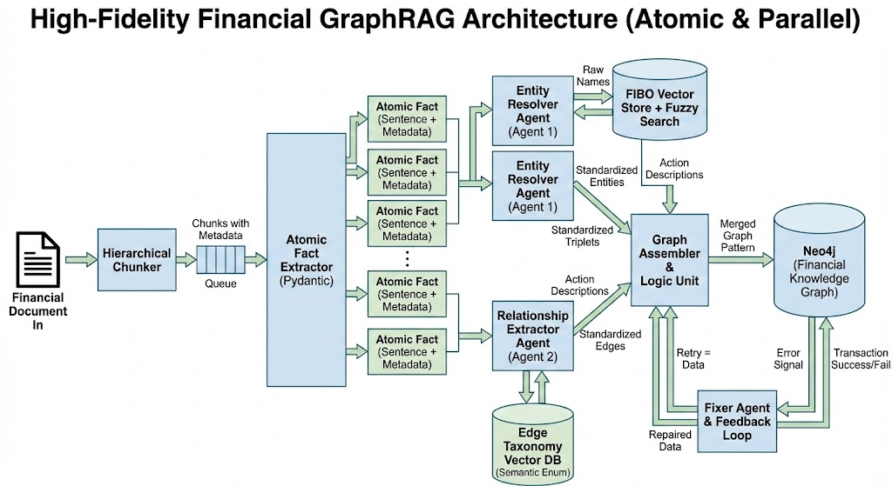

# Knowledge Graph for ZommaLabsKG 

ZommaLabsKG is an ingestion pipeline that transforms messy PDFs (10-Ks, Earnings Calls, Press Releases) into a Strict, Typed Knowledge Graph. We provide Deterministic Grounding for your Agents:

- FIBO-Standardized Entities: Every company is resolved to its unique Financial Industry Business Ontology ID.
- Atomic Facts: Text is broken into single-sentence propositions with precise time-stamping.
- Strict Edges: Relationships are classified into a fixed enum (e.g., ACQUIRED, SUED), making them SQL/CYPHER-queryable.

## Diagram
 

### The Pipeline Flow
1. **Hierarchical Ingestion**: Documents are split by Headers/Sections to preserve context.
2. **Atomic Fact Extraction**: Chunks are atomized into single-sentence "Propositions" (Fact Nodes) with Reflexion for self-correction.
3. **Parallel Resolution (The "Split Brain")**:
    1. **Agent A (The Librarian)**: Resolves Entities against FIBO using **Hybrid Search (Vector + Fuzzy)**. Enforces a **90% confidence threshold**; creates "New Entities" if no match is found.
    2. **Agent B (The Analyst)**: Classifies Relationships against a strict Semantic Enum (e.g., `RAISED_POLICY_RATE`, `CAUSED`) to determine the `fact_type`.
4. **Graph Assembly**: Creates typed `FactNode`s in Neo4j, links them to resolved `Entity` nodes, and connects them to `EpisodicNode`s for provenance.
5. **Causal Linking**: The `CausalLinker` agent scans the facts to identify and create explicit `[:CAUSES]` edges between them.

### System Architecture
The pipeline uses a Parallel Agentic Workflow (powered by LangGraph) to ensure high fidelity.

1. **The "Atomizer" (Ingestion)**
    - Splits documents by Section Headers.
    - Explodes paragraphs into Atomic Facts.
    - **Completeness Rule**: Facts must be self-contained. Speaker + message stay together.
    - **Reflexion Loop**: Self-corrects to ensure no facts are missed.

2. **The "Entity Extractor" (Relation Extraction)**
    - **Multi-Relation Patterns**: A single fact can produce multiple relations:
        - **List Expansion**: "Subsidiaries include A, B, C" → 3 separate relations
        - **Source Attribution**: "CEO revealed that X inspired Y" → Content relation + Source relation
    - Structured prompt with 4 sections: Entity Resolution, Relationship Extraction, Multi-Relation Patterns, Validation

3. **The "Dual-Brain" Resolver (Transformation)**
    - **Stream A (Nouns - Librarian)**:
        - Hybrid Search: Combines Qdrant Vector Search with RapidFuzz.
        - Thresholding: < 90% confidence -> Creates new UUID.
    - **Stream B (Verbs - Analyst)**:
        - Classifies facts into types like `REPORTED_FINANCIALS` or `CAUSED`.

4. **The "Causal Linker" (Reasoning)**
    - Connects `FactNode`s based on logical flow.
    - Example: `(Fed Raised Rates) -[:CAUSES]-> (Stocks Dropped)`

5. **The "Assembler" (Loading)**
    - Writes to Neo4j using the **Fact-as-Node** pattern.
    - Ensures all Entities have `name` properties and correct FIBO URIs.

### Strict Edge Taxonomy (Expanded)
To prevent "Schema Drift," the LLM is restricted to high-value verbs:
- **Corporate**: `ACQUIRED`, `MERGED_WITH`, `SPUN_OFF`, `INVESTED_IN`
- **Legal**: `SUED`, `FINED`, `INVESTIGATED_BY`
- **Causal**: `CAUSED`, `EFFECTED_BY`, `CONTRIBUTED_TO`, `PREVENTED`
- **Financial**: `RAISED_POLICY_RATE`, `REPORTED_FINANCIALS`, `ISSUED_GUIDANCE`

### Directory Structure
```text
src/
├── agents/                     # The "Brains"
│   ├── init.py
│   ├── atomizer.py             # Fact Extraction + Reflexion
│   ├── FIBO_librarian.py       # Hybrid Entity Resolution
│   ├── graph_assembler.py      # Fact-as-Node Creator
│   └── causal_linker.py        # Causal Inference Agent
│
├── schemas/                    # The "Contracts"
│   ├── atomic_fact.py
│   ├── relationship.py         # Expanded Relationship Enums
│   └── nodes.py                # Neo4j Node Definitions
│
├── workflows/                  # The "Orchestration"
│   ├── main_pipeline.py        # LangGraph Pipeline
│
├── scripts/                    # Utilities
│   ├── setup_graph_index.py    # Initializes Vector Indices
│   ├── test_large_pipeline.py  # End-to-End Verification
│   └── run_pipeline.py         # Batch Processing
│
└── config/                     # Configuration
    └── settings.py
```

### Setup & Usage
1. **Initialize Indices**:
   ```bash
   uv run src/scripts/setup_graph_index.py
   ```
2. **Run Verification**:
   ```bash
   uv run src/scripts/test_large_pipeline.py
   ```
3. **Process Documents**:
   ```bash
   uv run scripts/run_pipeline.py
   ```